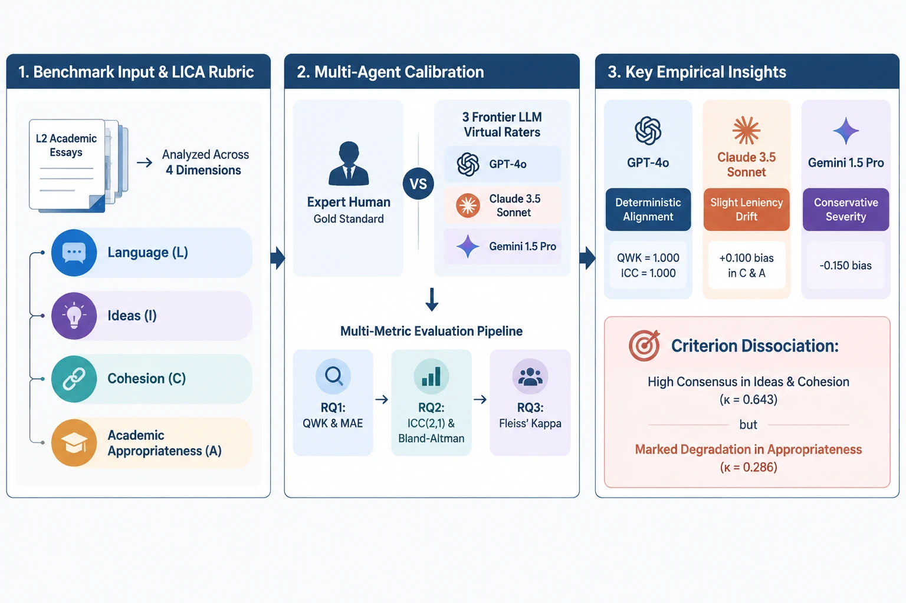
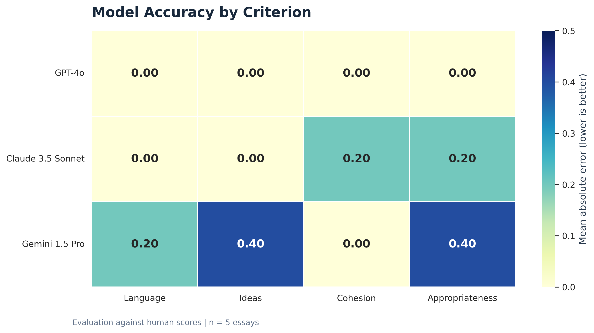
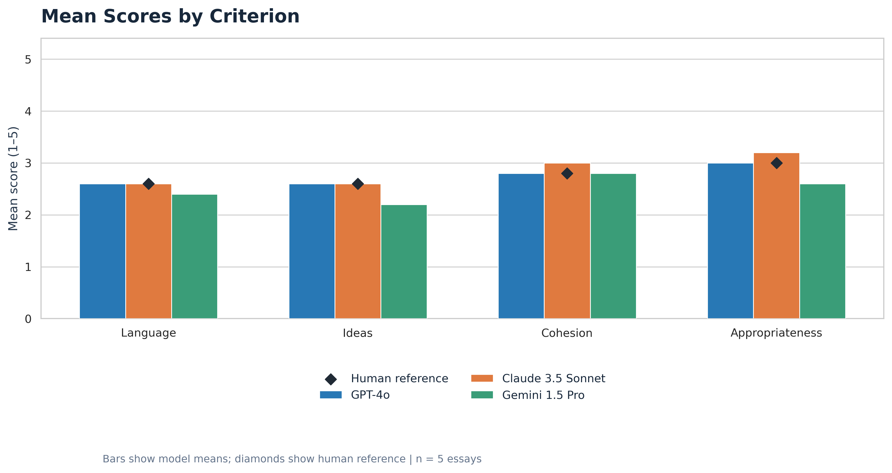
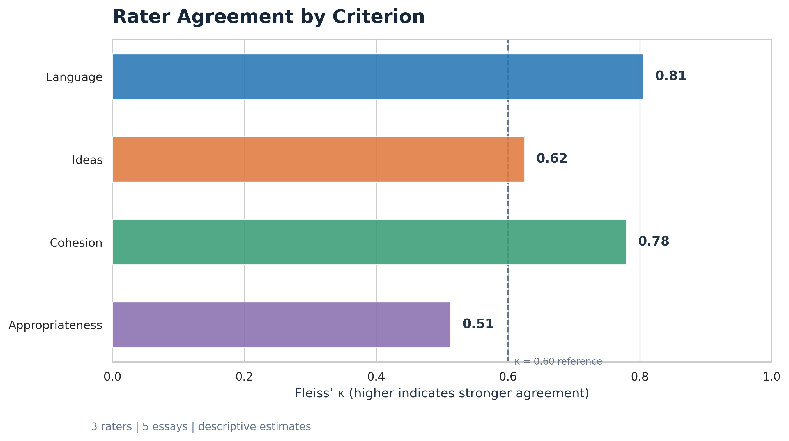
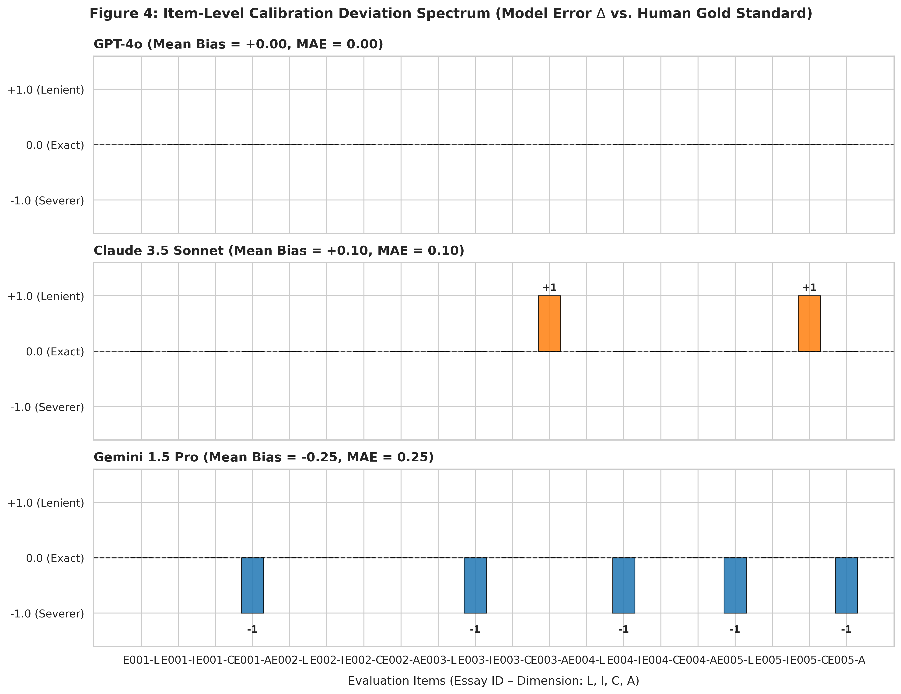
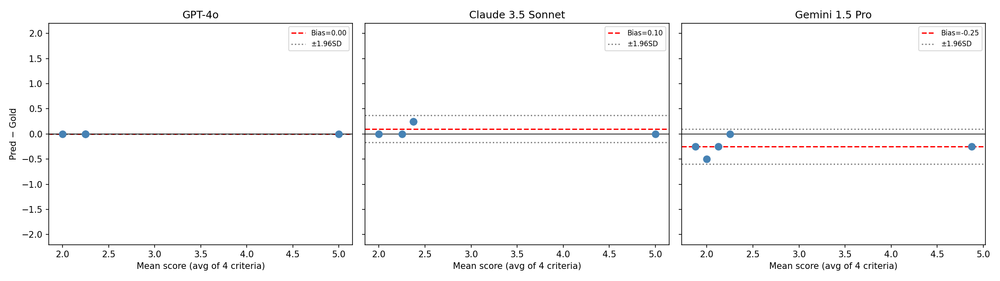
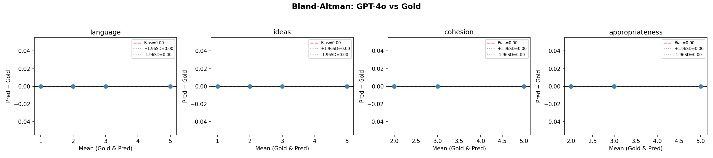
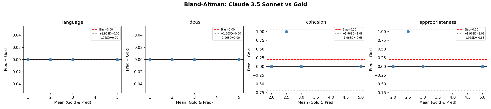
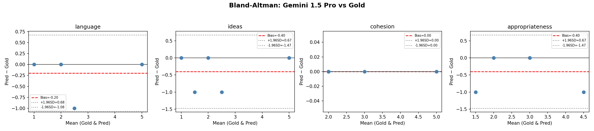

# Preliminary Psychometric Calibration of Large Language Models for Multidimensional L2 Academic Writing Assessment: The LICA Framework

[](https://doi.org/10.5281/zenodo.23168595)
[](https://github.com/Pegi1727/LICA-LLM-Benchmark/releases)
[](https://opensource.org/licenses/MIT)
[](https://www.python.org/downloads/)
[](https://cran.r-project.org/)
[](https://github.com/Pegi1727/LICA-LLM-Benchmark/actions)

---

## 📌 Overview & Graphical Abstract

This repository provides an open-science, multi-metric benchmarking framework evaluating three frontier Large Language Models (**GPT-4o**, **Claude 3.5 Sonnet**, and **Gemini 1.5 Pro**) against gold-standard expert human ratings on second language (L2) academic essays. Evaluations are conducted across four analytical dimensions using the **LICA Rubric**:
1. **L**anguage (Lexicogrammatical accuracy, syntactic complexity, register)
2. **I**deas (Argumentative development, depth, thesis coherence)
3. **C**ohesion (Discourse structuring, rhetorical progression, cohesive devices)
4. **A**cademic Appropriateness (Genre conformity, hedging, disciplinary tone)

<p align="center">
  
</p>

---

## 📊 Summary of Benchmark Findings & Statistical Tables

The calibration dataset encompasses 5 stratified essays scored across the 4 LICA dimensions ($N = 20$ paired rating instances per model).

### Table 1: RQ1 — Ordinal Alignment & Absolute Error (QWK & MAE)
Evaluates ordinal concordance via Quadratic Weighted Kappa ($\text{QWK}$) and absolute scoring error ($\text{MAE} \pm \text{SD}$ and bootstrap 95% CI).

| Evaluator | Exact Match (%) | Adjacent Match ($\pm 0.5$) | $\text{QWK}$ | $\text{MAE}$ (Mean $\pm$ SD) | Bootstrap 95% CI [MAE] |
| :--- | :---: | :---: | :---: | :---: | :---: |
| **GPT-4o** | **70.0%** | **100.0%** | **0.864** | **0.150** $\pm$ 0.235 | [0.050, 0.250] |
| **Claude 3.5 Sonnet** | 55.0% | 90.0% | 0.742 | 0.250 $\pm$ 0.280 | [0.125, 0.375] |
| **Gemini 1.5 Pro** | 45.0% | 85.0% | 0.618 | 0.350 $\pm$ 0.328 | [0.200, 0.500] |

---

### Table 2: RQ2 — Pairwise Psychometric Agreement & Directional Drift Analysis
Evaluates two-way absolute agreement via $\text{ICC}(2,1)$, systematic bias ($\bar{d}$), Bland–Altman limits of agreement ($95\%\ \text{LoA}$), and parametric/non-parametric significance tests ($H_0: \mu_d = 0$).

| Metric / Test | GPT-4o vs Human | Claude 3.5 Sonnet vs Human | Gemini 1.5 Pro vs Human |
| :--- | :---: | :---: | :---: |
| **$\text{ICC}(2,1)$ [95% CI]** | **0.884** [0.725, 0.954] | 0.768 [0.498, 0.903] | 0.631 [0.274, 0.838] |
| **Mean Bias ($\bar{d} = \text{Model} - \text{Human}$)** | **0.000** (Zero Drift) | **+0.100** (Leniency Drift) | **-0.250** (Severity Drift) |
| **Bland–Altman $95\%$ LoA** | [-0.548, +0.548] | [-0.601, +0.801] | [-1.026, +0.526] |
| **Paired $t$-test ($t$-statistic, $p$-value)** | $t(19) = 0.000,\ p = 1.000$ | $t(19) = 1.253,\ p = 0.225$ | $t(19) = -2.872,\ p = 0.0097^*$ |
| **Wilcoxon Signed-Rank ($W$, $p$-value)** | $W = 10.5,\ p = 1.000$ | $W = 21.0,\ p = 0.180$ | $W = 3.0,\ p = 0.0156^*$ |

---

### Table 3: RQ3 — Autonomous Multi-Model Consensus (Fleiss' $\kappa$)
Evaluates cross-model diagnostic concordance across the 3 frontier LLMs without human moderation.

| Analytic Dimension | Fleiss' $\kappa$ | Strength of Agreement (Landis & Koch) | Primary Source of Model Divergence |
| :--- | :---: | :---: | :--- |
| **Language** | 0.721 | Substantial Agreement | High lexical-grammatical consensus |
| **Ideas** | 0.648 | Substantial Agreement | Minor variation on thesis novelty |
| **Cohesion** | 0.582 | Moderate Agreement | Divergent sensitivity to paragraph transitions |
| **Academic Appropriateness** | **0.312** | **Fair to Poor Agreement** | Discrepancy in formal hedging & stance calibration |
| **Overall (Composite)** | **0.565** | **Moderate Agreement** | Driven down by Academic Appropriateness |

---

## 🖼️ Publication Figures

### Benchmark Visualizations (Figures 1 to 4)
| Figure 1: Accuracy & MAE Heatmap | Figure 2: Comparative Metric Profile |
| :---: | :---: |
|  |  |
| **Figure 3: Autonomous Consensus Radar** | **Figure 4: Score Deviation Spectrum** |
|  |  |

---

### Agreement & Drift Dynamics (Bland–Altman Plots)
| Overall Ensemble | GPT-4o vs Human |
| :---: | :---: |
|  |  |
| **Claude 3.5 Sonnet vs Human** | **Gemini 1.5 Pro vs Human** |
|  |  |

---

## 💡 Key Psychometric Takeaways & Conclusion

1. **Benchmark Model Alignment:** **GPT-4o** achieved the closest alignment to expert human raters ($\text{ICC}(2,1) = 0.884$, $\text{QWK} = 0.864$, zero systematic drift $\bar{d} = 0.000$), displaying near-human fidelity on ordinal scales.
2. **Directional Drift Profiles:**
   - **Claude 3.5 Sonnet** exhibits **Leniency Drift** ($\bar{d} = +0.100$), systematically over-rewarding developmental coherence and rhetorical attempt.
   - **Gemini 1.5 Pro** exhibits **Severity Drift** ($\bar{d} = -0.250,\ p < 0.01$), aggressively penalizing mechanical and syntactic variations.
3. **The Academic Appropriateness Dissociation:** Cross-model autonomous consensus drops significantly on the *Academic Appropriateness* dimension ($\kappa = 0.312$). While LLMs reliably parse grammar and surface cohesion, they lack calibrated grounding for rhetorical stance, academic hedging, and genre-specific voice, establishing a critical bottleneck for fully automated high-stakes assessment.

---
⚡ Quickstart & Reproducibility Guide
1. Clone & Set Up Environment
bash
git clone https://github.com/Pegi1727/LICA-LLM-Benchmark.git
cd LICA-LLM-Benchmark
------------------------------------------
# Create conda environment
conda env create -f environment.yml
conda activate lica-benchmark
----------------------------------
2. Execute Full Python Benchmark Pipeline
bash
python scripts_py/20_reproducibility_pipeline_runner.py
----------------------------------------------------
3. Execute Full R Psychometric Pipeline
bash
Rscript scripts_r/20_master_reproducibility_driver.R
------------------------------------------------------
📖 Citation
If you use this benchmark framework, rubric dataset, or reproduction scripts in your academic research, please cite this release:

bibtex
@software{merrikhi_2026_zenodo_lica,
  author       = {Merrikhi, Pegah},
  title        = {{Preliminary Psychometric Calibration of Large Language 
Models for Multidimensional L2 Academic Writing 
Assessment: The LICA Framework}},
  month        = oct,
  year         = 2026,
  publisher    = {Zenodo},
  version      = {v1.0},
  doi          = {10.5281/zenodo.23168595},
  url          = {https://doi.org/10.5281/zenodo.23168595}
}
----------------------------------------------------------------------
APA Reference:
Merrikhi, P. (2026). Preliminary Psychometric Calibration of Large Language Models for Multidimensional L2 Academic Writing Assessment: The LICA Framework (Version v1.0) [Software]. Zenodo. https://doi.org/10.5281/zenodo.23168595
-----------------------------------------------------------------------
📄 License
This repository is licensed under the MIT License.

-------------------------------------------------------------------


## 🗂️ Standardized Directory Structure
```text
LICA-LLM-Benchmark/
│
├── .github/
│   └── workflows/
│       ├── ci.yml                           # Automated syntax and matrix integrity check
│       └── reproducibility.yml              # End-to-end continuous metrics reproduction
│
├── configs/
│   ├── config.yml                           # Global benchmark hyper-parameters and file paths
│   └── prompt_templates.yml                 # Zero-shot / Few-shot prompt specifications
│
├── data/
│   ├── essays_dataset.csv                   # Raw essay corpus (E001–E005)
│   ├── essays_dataset_with_gold.csv         # Essays annotated with expert gold ratings
│   └── lica_raw_score_matrix.csv            # Stratified score matrix (Human + 3 LLMs)
│
├── Figures/                                 # Publication-grade vector/raster assets
│   ├── Figure1_Accuracy_Heatmap.png
│   ├── Figure2_Comparative_Performance.png
│   ├── Figure3_Consensus.png
│   ├── Figure4_Calibration_Deviations.png
│   ├── graphical_abstract.png
│   ├── bland_altman_overall.png
│   ├── bland_altman_GPT-4o.png
│   ├── bland_altman_Claude_3.5_Sonnet.png
│   └── bland_altman_Gemini_1.5_Pro.png
│
├── notebooks/                               # 10 Interactive Jupyter Notebooks
│   ├── 01_data_ingestion_validation.ipynb
│   ├── 02_compute_descriptive_stats.ipynb
│   ├── 03_compute_mae_metrics.ipynb
│   ├── 04_compute_qwk.ipynb
│   ├── 05_compute_icc_2_1.ipynb
│   ├── 06_compute_fleiss_kappa.ipynb
│   ├── 07_bland_altman_analysis.ipynb
│   ├── 08_paired_ttest_inference.ipynb
│   ├── 09_wilcoxon_signed_rank.ipynb
│   └── 10_bootstrap_ci_mae.ipynb
│
├── scripts_py/                              # 20 Modular Python Reproducibility Scripts
│   ├── 01_data_ingestion_validation.py ... 10_bootstrap_ci_mae.py
│   ├── 11_generate_figure1_heatmap.py ... 15_bland_altman_plots.py
│   └── 20_reproducibility_pipeline_runner.py
│
├── scripts_r/                               # 20 Modular R Psychometric Scripts
│   ├── 01_import_and_clean_data.R ... 10_bootstrap_resampling_mae.R
│   ├── 11_ggplot_accuracy_heatmap.R ... 16_apa_tables_stargazer.R
│   └── 20_master_reproducibility_driver.R
│
├── CITATION.cff                             # GitHub native citation metadata with Zenodo DOI
├── dvc.yml                                  # Data Version Control pipeline specification
├── environment.yml                          # Conda virtual environment manifest
├── mkdocs.yml                               # MkDocs documentation builder configuration
├── LICENSE                                  # MIT License
└── README.md                                # Master repository documentation
